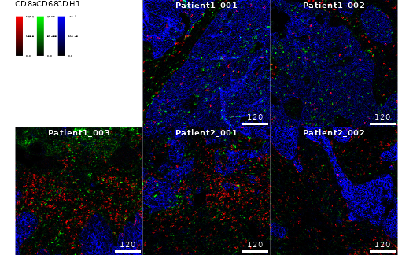
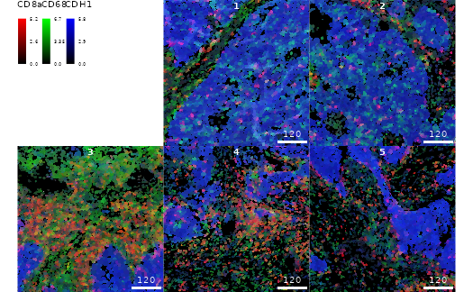
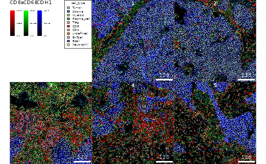

# Accessing IMC datasets

## Introduction

The *[imcdatasets](https://bioconductor.org/packages/3.24/imcdatasets)*
package provides access to publicly available datasets generated using
imaging mass cytometry (IMC) (Giesen et al. 2014).

IMC is a technology that enables measurement of up to 50 markers from
tissue sections at a resolution of 1 $\mu m$Giesen et al. (2014). In
classical processing pipelines, such as the
[ImcSegmentationPipeline](https://github.com/BodenmillerGroup/ImcSegmentationPipeline)
or [steinbock](https://bodenmillergroup.github.io/steinbock/latest/),
the multichannel images are segmented to generate cells masks. These
masks are then used to extract single cell features from the
multichannel images.

Each dataset in `imcdatasets` is composed of three elements that can be
retrieved separately:  
1. Single-cell data in the form of a `SingleCellExperiment` or
`SpatialExperiment` class object (named `sce.rds`).  
2. Multichannel images in the form of a `CytoImageList` class object
(named `images.rds`).  
3. Cell segmentation masks in the form of a `CytoImageList` class object
(named `masks.rds`).

## Available datasets

The
[`listDatasets()`](https://bodenmillergroup.github.io/imcdatasets/reference/listDatasets.md)
function returns all available datasets in `imcdatasets`, along with
associated information. The `FunctionCall` column gives the name of the
R function that enables to load the dataset.

``` r
datasets <- listDatasets()
datasets <- as.data.frame(datasets)
datasets$FunctionCall <- sprintf("`%s`", datasets$FunctionCall)
knitr::kable(datasets)
```

| FunctionCall                                                                                                                         | Species | Tissue                | NumberOfCells | NumberOfImages | NumberOfChannels | Reference               |
|:-------------------------------------------------------------------------------------------------------------------------------------|:--------|:----------------------|--------------:|---------------:|-----------------:|:------------------------|
| [`Damond_2019_Pancreas()`](https://bodenmillergroup.github.io/imcdatasets/reference/Damond_2019_Pancreas.md)                         | Human   | Pancreas              |        252059 |            100 |               38 | Damond et al. (2019)    |
| [`HochSchulz_2022_Melanoma()`](https://bodenmillergroup.github.io/imcdatasets/reference/HochSchulz_2022_Melanoma.md)                 | Human   | Metastatic melanoma   |        325881 |             50 |               41 | Hoch et al. (2022)      |
| [`JacksonFischer_2020_BreastCancer()`](https://bodenmillergroup.github.io/imcdatasets/reference/JacksonFischer_2020_BreastCancer.md) | Human   | Primary breast tumour |        285851 |            100 |               42 | Jackson et al. (2020)   |
| [`Zanotelli_2020_Spheroids()`](https://bodenmillergroup.github.io/imcdatasets/reference/Zanotelli_2020_Spheroids.md)                 | Human   | Cell line spheroids   |        229047 |            517 |               51 | Zanotelli et al. (2020) |
| [`IMMUcan_2022_CancerExample()`](https://bodenmillergroup.github.io/imcdatasets/reference/IMMUcan_2022_CancerExample.md)             | Human   | Primary tumor         |         46825 |             14 |               40 | None                    |
| `Meyer_2025_TripleNegativeBreastCancer`                                                                                              | Human   | Primary breast tumor  |        257680 |            125 |               39 | Meyer et al. (2025)     |

## Retrieving data

Users can import the datasets by calling a single function and
specifying the type of data to retrieve. The following examples
highlight accessing an example dataset linked to the
[IMMUcan](https://immucan.eu/) project.

**Importing single-cell expression data and metadata**

``` r
sce <- IMMUcan_2022_CancerExample("sce")
sce
```

    ## class: SingleCellExperiment 
    ## dim: 40 47794 
    ## metadata(5): color_vectors cluster_codes SOM_codes delta_area
    ##   filterSpatialContext
    ## assays(2): counts exprs
    ## rownames(40): MPO H3 ... DNA1 DNA2
    ## rowData names(17): channel metal ... ilastik deepcell
    ## colnames(47794): 1_1 1_2 ... 14_2844 14_2845
    ## colData names(43): sample_id ObjectNumber ... cell_x cell_y
    ## reducedDimNames(8): UMAP TSNE ... seurat UMAP_seurat
    ## mainExpName: IMMUcan_2022_CancerExample_v1
    ## altExpNames(0):

**Importing multichannel images**

``` r
images <- IMMUcan_2022_CancerExample("images")
images
```

    ## CytoImageList containing 14 image(s)
    ## names(14): Patient1_001 Patient1_002 Patient1_003 Patient2_001 Patient2_002 Patient2_003 Patient2_004 Patient3_001 Patient3_002 Patient3_003 Patient4_005 Patient4_006 Patient4_007 Patient4_008 
    ## Each image contains 40 channel(s)
    ## channelNames(40): MPO H3 SMA CD16 CD38 HLA_DR CD27 CD15 CD45RA CD163 B2M CD20 CD68 IDO1 CD3e LAG3 CD11c PD_1 PDGFRB CD7 GZMB PD_L1 TCF7 CD45RO FOXP3 ICOS CD8a CA9 CD33 Ki67 VISTA CD40 CD4 CD14 CDH1 CD303 CD206 c_PARP DNA1 DNA2

**Importing cell segmentation masks**

``` r
masks <- IMMUcan_2022_CancerExample("masks")
masks
```

    ## CytoImageList containing 14 image(s)
    ## names(14): Patient1_001 Patient1_002 Patient1_003 Patient2_001 Patient2_002 Patient2_003 Patient2_004 Patient3_001 Patient3_002 Patient3_003 Patient4_005 Patient4_006 Patient4_007 Patient4_008 
    ## Each image contains 1 channel

**On disk storage**

Objects containing multi-channel images and segmentation masks can
furthermore be stored on disk rather than in memory. Nevertheless, they
need to be loaded into memory once before writing them to disk. This
process takes longer than keeping them in memory but reduces memory
requirements during downstream analysis.

To write images or masks to disk, set `on_disk = TRUE` and specify a
path where images/masks will be stored as .h5 files:

``` r
# Create temporary location
cur_path <- tempdir()

masks <- IMMUcan_2022_CancerExample(data_type = "masks", on_disk = TRUE,
    h5FilesPath = cur_path)
masks
```

    ## CytoImageList containing 14 image(s)
    ## names(14): Patient1_001 Patient1_002 Patient1_003 Patient2_001 Patient2_002 Patient2_003 Patient2_004 Patient3_001 Patient3_002 Patient3_003 Patient4_005 Patient4_006 Patient4_007 Patient4_008 
    ## Each image contains 1 channel

## Dataset info and metadata

Additional information about each dataset is available in the help page:

``` r
?IMMUcan_2022_CancerExample
```

The metadata associated with a specific data object can be displayed as
follows:

``` r
IMMUcan_2022_CancerExample(data_type = "sce", metadata = TRUE)
IMMUcan_2022_CancerExample(data_type = "images", metadata = TRUE)
IMMUcan_2022_CancerExample(data_type = "masks", metadata = TRUE)
```

## Usage

The `SingleCellExperiment` class objects can be used for data analysis.
For more information, please refer to the
*[SingleCellExperiment](https://bioconductor.org/packages/3.24/SingleCellExperiment)*
package and to the [Orchestrating Single-Cell Analysis with
Bioconductor](http://bioconductor.org/books/release/OSCA/) workflow.

The `CytoImageList` class objects can be used for plotting cell and
pixel information. Some typical use cases are given below. For more
information, please see the
*[cytomapper](https://bioconductor.org/packages/3.24/cytomapper)*
package and the [associated
vignette](https://www.bioconductor.org/packages/devel/bioc/vignettes/cytomapper/inst/doc/cytomapper.html).

**Subsetting the images and masks**

``` r
cur_images <- images[1:5]
cur_masks <- masks[1:5]
```

**Plotting pixel information**

The `images` objects can be used to display pixel-level data.

``` r
plotPixels(
    cur_images,
    colour_by = c("CD8a", "CD68", "CDH1"),
    bcg = list(
        CD8a = c(0,4,1),
        CD68 = c(0,5,1),
        CDH1 = c(0,5,1)
    )
)
```



**Plotting cell information**

The `masks` and `sce` objects can be combined to display cell-level
data.

``` r
plotCells(
    cur_masks, object = sce,
    img_id = "image_number", cell_id = "cell_number",
    colour_by = c("CD8a", "CD68", "CDH1"),
    exprs_values = "exprs"
)
```



**Outlining cells on images**

Cell information can be displayed on top of images by combining the
`images`, `masks` and `sce` objects.

``` r
plotPixels(
    cur_images, mask = cur_masks, object = sce,
    img_id = "image_number", cell_id = "cell_number",
    outline_by = "cell_type",
    colour_by = c("CD8a", "CD68", "CDH1"),
    bcg = list(
        CD8a  = c(0,5,1),
        CD68 = c(0,5,1),
        CDH1 = c(0,5,1)
    )
)
```



## Session info

    ## R version 4.6.1 (2026-06-24)
    ## Platform: x86_64-pc-linux-gnu
    ## Running under: Ubuntu 24.04.4 LTS
    ## 
    ## Matrix products: default
    ## BLAS:   /usr/lib/x86_64-linux-gnu/blas/libblas.so.3.12.0 
    ## LAPACK: /usr/lib/x86_64-linux-gnu/lapack/liblapack.so.3.12.0  LAPACK version 3.12.0
    ## 
    ## locale:
    ##  [1] LC_CTYPE=C.UTF-8       LC_NUMERIC=C           LC_TIME=C.UTF-8       
    ##  [4] LC_COLLATE=C.UTF-8     LC_MONETARY=C.UTF-8    LC_MESSAGES=C.UTF-8   
    ##  [7] LC_PAPER=C.UTF-8       LC_NAME=C              LC_ADDRESS=C          
    ## [10] LC_TELEPHONE=C         LC_MEASUREMENT=C.UTF-8 LC_IDENTIFICATION=C   
    ## 
    ## time zone: Etc/UTC
    ## tzcode source: system (glibc)
    ## 
    ## attached base packages:
    ## [1] stats4    stats     graphics  grDevices datasets  utils     methods  
    ## [8] base     
    ## 
    ## other attached packages:
    ##  [1] imcdatasets_1.21.2          SpatialExperiment_1.23.0   
    ##  [3] cytomapper_1.25.0           EBImage_4.55.1             
    ##  [5] SingleCellExperiment_1.35.1 SummarizedExperiment_1.43.0
    ##  [7] Biobase_2.73.1              GenomicRanges_1.65.0       
    ##  [9] Seqinfo_1.3.0               IRanges_2.47.2             
    ## [11] S4Vectors_0.51.5            BiocGenerics_0.59.8        
    ## [13] generics_0.1.4              MatrixGenerics_1.25.0      
    ## [15] matrixStats_1.5.0           BiocStyle_2.41.0           
    ## 
    ## loaded via a namespace (and not attached):
    ##   [1] DBI_1.3.0            bitops_1.0-9         httr2_1.2.3         
    ##   [4] gridExtra_2.3.1      rlang_1.2.0          magrittr_2.0.5      
    ##   [7] svgPanZoom_0.3.4     shinydashboard_0.7.3 otel_0.2.0          
    ##  [10] RSQLite_3.53.3       compiler_4.6.1       png_0.1-9           
    ##  [13] systemfonts_1.3.2    fftwtools_0.9-11     vctrs_0.7.3         
    ##  [16] crayon_1.5.3         pkgconfig_2.0.3      fastmap_1.2.0       
    ##  [19] dbplyr_2.6.0         magick_2.9.1         XVector_0.53.0      
    ##  [22] promises_1.5.0       rmarkdown_2.31       ggbeeswarm_0.7.3    
    ##  [25] ragg_1.5.2           purrr_1.2.2          bit_4.6.0           
    ##  [28] xfun_0.59            cachem_1.1.0         jsonlite_2.0.0      
    ##  [31] blob_1.3.0           later_1.4.8          rhdf5filters_1.25.0 
    ##  [34] DelayedArray_0.39.3  Rhdf5lib_2.1.0       BiocParallel_1.47.0 
    ##  [37] jpeg_0.1-11          tiff_0.1-12          terra_1.9-34        
    ##  [40] parallel_4.6.1       R6_2.6.1             bslib_0.11.0        
    ##  [43] RColorBrewer_1.1-3   jquerylib_0.1.4      Rcpp_1.1.1-1.1      
    ##  [46] bookdown_0.47        knitr_1.51           httpuv_1.6.17       
    ##  [49] Matrix_1.7-5         nnls_1.6             tidyselect_1.2.1    
    ##  [52] abind_1.4-8          yaml_2.3.12          viridis_0.6.5       
    ##  [55] codetools_0.2-20     curl_7.1.0           lattice_0.22-9      
    ##  [58] tibble_3.3.1         withr_3.0.3          KEGGREST_1.53.1     
    ##  [61] shiny_1.14.0         S7_0.2.2             evaluate_1.0.5      
    ##  [64] desc_1.4.3           BiocFileCache_3.3.0  Biostrings_2.81.3   
    ##  [67] ExperimentHub_3.3.0  filelock_1.0.3       pillar_1.11.1       
    ##  [70] BiocManager_1.30.27  renv_1.2.3           sp_2.2-1            
    ##  [73] RCurl_1.98-1.19      BiocVersion_3.24.0   ggplot2_4.0.3       
    ##  [76] scales_1.4.0         xtable_1.8-8         glue_1.8.1          
    ##  [79] tools_4.6.1          AnnotationHub_4.3.1  locfit_1.5-9.12     
    ##  [82] fs_2.1.0             rhdf5_2.57.1         grid_4.6.1          
    ##  [85] AnnotationDbi_1.75.0 raster_3.6-32        beeswarm_0.4.0      
    ##  [88] HDF5Array_1.41.0     vipor_0.4.7          cli_3.6.6           
    ##  [91] rappdirs_0.3.4       textshaping_1.0.5    S4Arrays_1.13.0     
    ##  [94] viridisLite_0.4.3    svglite_2.2.2        dplyr_1.2.1         
    ##  [97] gtable_0.3.6         sass_0.4.10          digest_0.6.39       
    ## [100] SparseArray_1.13.2   rjson_0.2.23         htmlwidgets_1.6.4   
    ## [103] farver_2.1.2         memoise_2.0.1        htmltools_0.5.9     
    ## [106] pkgdown_2.2.0        lifecycle_1.0.5      httr_1.4.8          
    ## [109] h5mread_1.5.0        mime_0.13            bit64_4.8.2

## References

Damond, N., S. Engler, V. R. T. Zanotelli, D. Schapiro, C. H.
Wasserfall, I. Kusmartseva, H. S. Nick, et al. 2019. “A Map of Human
Type 1 Diabetes Progression by Imaging Mass Cytometry.” *Cell Metab.* 29
(3): 755–768.e5.

Giesen, C., H. A. O. Wang, D. Schapiro, N. Zivanovic, A. Jacobs, B.
Hattendorf, P. J. Schüffler, et al. 2014. “Highly Multiplexed Imaging of
Tumor Tissues with Subcellular Resolution by Mass Cytometry.” *Nat.
Methods* 11 (4): 417–22.

Hoch, T., D. Schulz, N. Eling, M. Martinez Gomez, M. P. Levesque, and B.
Bodenmiller. 2022. “Multiplexed Imaging Mass Cytometry of the Chemokine
Milieus in Melanoma Characterizes Features of the Response to
Immunotherapy.” *Sci. Immunol.* 70 (7): abk1692.

Jackson, H. W., J. R. Fischer, V. R. T. Zanotelli, R. H. Ali, R.
Mechera, S. D. Soysal, H. Moch, et al. 2020. “The Single-Cell Pathology
Landscape of Breast Cancer.” *Nature* 578 (7796): 615–20.

Meyer, Lasse, Hartland W Jackson, Nils Eling, Shan Zhao, Genki Usui,
Haithem Dakhli, Peter Schraml, et al. 2025. “A Stratification System for
Breast Cancer Based on Basoluminal Tumor Cells and Spatial Tumor
Architecture.” *Cancer Cell* 43 (9): 1637–1655.e9.

Zanotelli, V. R. T., M. Leutenegger, X. K. Lun, F. Georgi, N. de Souza,
and B. Bodenmiller. 2020. “A Quantitative Analysis of the Interplay of
Environment, Neighborhood, and Cell State in 3D Spheroids.” *Mol Syst
Biol* 16 (12): e9798.
